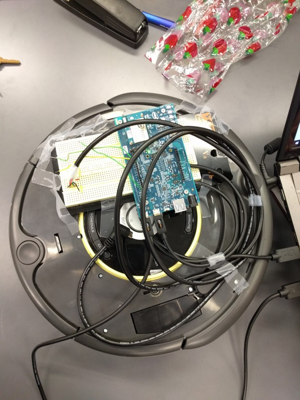

# PathFinder-Roomba

The solution to autonomous driving without permanent network connectivity. 

Using BLE Beacons, the user can set a path for the robot to traverse. The robot first connects to WiFi in order to request the desired 
path from the Web API, which provides the order of BLE Beacons to follow as well as the angles required to turn in order to move towards
each Beacon from the previous. The Intel Edison, which is wired to the robot, utilizes a Node script in order to find the approximate 
distance from the current position to the target Beacon. After traveling the calculated distance, another scan is done to see if the
Edison is close enough to the Beacon to make the next turn. This process is followed until the final Beacon is reached, during which
the robot turns back and follows saved angles to return home. 

Details of the traversal algorithm:
- The Intel Edison determines if it is "close enough" to the target Beacon by checking whether the distance between the current position
  and the target Beacon is less than a defined constant
- The Intel Edison keeps track of the last scanned distance for each step of the traversal. If the latest reading is worse than the 
  last (the Edison is further away from the Beacon than before) the robot will drive backwards during the next movement
- The Edison calculates the angles to turn to return home by subtracting 360° from each angle taken on the path

Technology Used:
- Intel Edison
- BLE Beacons
- iRobot Create 2
- MEAN Stack

Although this implementation was accomplished using the iRobot Create 2, the code can easily be adapted to any Arduino-Compatible 
hardware, such as drones.

Website: [https://ancient-gorge-84645.herokuapp.com/](https://ancient-gorge-84645.herokuapp.com/)

Picture of Intel Edison mounted on iRobot Create 2

